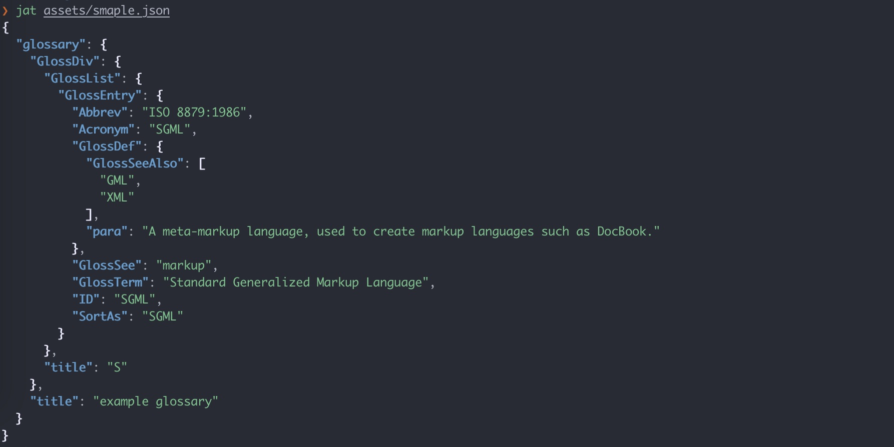

# :zap: jat :zap:



## Introduction

Jat means `json cat`, jat is a toy project designed to provide more beautiful json print as well as practice rust language

## Install

```bash
cargo build
```

## Usage

#### Output json from a file

```bash
jat assets/sample.json
```

#### Output json from stdin

```bash
cat assets/sample.json | jat
```

